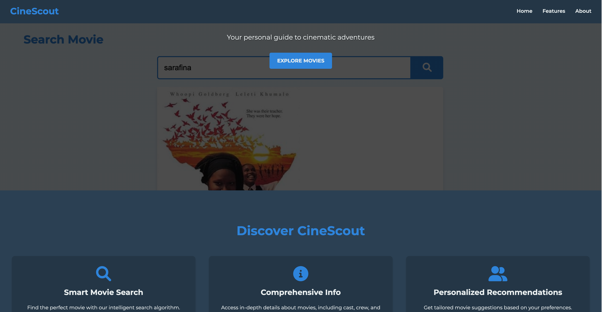

Welcome to the CineScout project! This project allows users to search for their favorite movies and get detailed information about them, including genre, cast, plot, and more.



## Table of Contents

- [Introduction](#introduction)
- [Features](#features)
- [Technologies Used](#technologies-used)
- [Installation](#installation)
- [Usage](#usage)
- [Contributing](#contributing)
- [License](#license)
- [Author](#author)
- [Acknowledgements](#acknowledgements)

## Introduction

CineScout is a web application designed to provide users with an intuitive way to explore movies. It utilizes the OMDB API to fetch movie data based on user input. Users can search for movies by title and view detailed information such as release year, ratings, actors, plot summary, and more.

## Features

- **Quick Movie Search:** Easily find movies using the search box.
- **Detailed Movie Information:** View comprehensive details about each movie.
- **User-friendly Interface:** Enjoy a seamless and intuitive user experience.

## Technologies Used

- **HTML5**: Structure of the web pages.
- **CSS3**: Styling and layout design.
- **JavaScript**: Functionality and interaction.
- **OMDB API**: External API for retrieving movie data.

## Installation

To run this project locally, follow these steps:

1. Clone the repository:
   ```bash
   git clone https://github.com/Piipip/CineScout.git

2. Navigate to the project directory:
Copy code
```bash
cd CineScout
```
Open index.html in your web browser.

## Usage
**Enter a movie title in the search box and press Enter.**
**Select a movie from the search results to view detailed information.**
**Explore different movies and enjoy discovering new films!**

## Contributing
Contributions are welcome! If you have any suggestions, improvements, or issues, please create a pull request or report an issue on the GitHub repository.

## License
This project is licensed under the MIT License.

## Author
Philip Owusu Koranteng  |  Github: (https://github.com/Piipip)

## Acknowledgements
**(https://www.alxafrica.com/) ALX School and Students**

